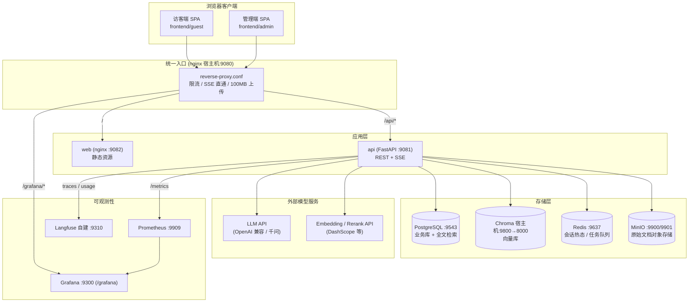

# AI 知识库 RAG 平台

基于大语言模型（LLM）的企业级智能知识库平台。提供文档上传与自动向量化、混合检索（向量 + 全文 + RRF 融合）、多轮流式问答、RBAC + 部门驱动的访问控制、命中率评测、快照与回退、以及 Prometheus/Grafana/Langfuse 全链路可观测能力。

- **应用版本**：`APP_VERSION=2.1.0`（与产品手册 V2.1 对齐）；**缓存改造一期**：分支 `ZY_Cache_V2.0`（按知识库 FAQ 缓存）
- **技术栈**：FastAPI（异步）· PostgreSQL（pg_trgm + tsvector）· Chroma（向量库）· Redis（会话热态）· MinIO（对象存储）· 原生 ES Module 前端 · Docker Compose 编排
- **统一入口（本机 Docker 默认）**：`http://localhost:9080`（Nginx 反向代理；容器与宿主机均为 9080）
- **云端部署**：见 [`docs/CLOUD_DEPLOY.md`](docs/CLOUD_DEPLOY.md)（`docker-compose.prod.yml` + `docker-compose.langfuse.yml`）
- **接入第三方 / App**：见 [`docs/API_INTEGRATION_GUIDE.md`](docs/API_INTEGRATION_GUIDE.md)
- **六维优化落地状态**：见 [`docs/OPTIMIZATION_STATUS.md`](docs/OPTIMIZATION_STATUS.md)
- **知识库 FAQ 缓存（V2.0 一期）**：见 [`docs/KB_FAQ.md`](docs/KB_FAQ.md)；排障 [`docs/FAQ_TROUBLESHOOTING.md`](docs/FAQ_TROUBLESHOOTING.md)；二期结项清单 [`docs/FAQ_PHASE2_ACCEPTANCE.md`](docs/FAQ_PHASE2_ACCEPTANCE.md)

---

## 目录

- [一、系统架构](#一系统架构)
  - [1.1 架构总览图](#11-架构总览图)
  - [1.2 请求链路](#12-请求链路)
  - [1.3 RAG 问答数据流](#13-rag-问答数据流)
  - [1.4 服务与端口](#14-服务与端口)
- [二、模块说明](#二模块说明)
  - [2.1 后端分层](#21-后端分层)
  - [2.2 核心业务模块](#22-核心业务模块)
  - [2.3 访问控制模型（部门驱动）](#23-访问控制模型部门驱动)
  - [2.4 文档处理流水线](#24-文档处理流水线)
  - [2.5 检索层](#25-检索层)
  - [2.6 前端](#26-前端)
  - [2.7 可观测性](#27-可观测性)
- [三、快速开始](#三快速开始)
- [四、配置说明（.env）](#四配置说明env)
- [五、数据模型](#五数据模型)
- [六、脚本与运维](#六脚本与运维)
- [七、接口契约与文档](#七接口契约与文档)
- [八、项目结构](#八项目结构)
- [九、协作约定](#九协作约定)

---

## 一、系统架构

平台采用「统一反向代理 + 无状态 API + 多存储后端」的容器化架构。所有外部流量经由单一 Nginx 入口（本机宿主机 **`:9080`** → 容器 `:9080`）分流到静态前端、FastAPI 后端与 Grafana；后端通过异步驱动访问四类存储（关系库 / 向量库 / 缓存 / 对象存储），并调用外部 LLM 与 Embedding HTTP API。Langfuse 自建 UI 另开 **`:9310`**。

### 1.1 架构总览图


```mermaid
flowchart TB
    subgraph Client["浏览器客户端"]
        Guest["访客端 SPA<br/>frontend/guest"]
        Admin["管理端 SPA<br/>frontend/admin"]
    end

    subgraph Edge["统一入口 (nginx 宿主机:9080)"]
        RP["reverse-proxy.conf<br/>限流 / SSE 直通 / 100MB 上传"]
    end

    subgraph App["应用层"]
        WEB["web (nginx :9082)<br/>静态资源"]
        API["api (FastAPI :9081)<br/>REST + SSE"]
    end

    subgraph Storage["存储层"]
        PG[("PostgreSQL :9543<br/>业务库 + 全文检索")]
        CH[("Chroma 宿主机:9800→8000<br/>向量库")]
        RD[("Redis :9637<br/>会话热态 / 任务队列")]
        MO[("MinIO :9900/9901<br/>原始文档对象存储")]
    end

    subgraph External["外部模型服务"]
        LLM["LLM API<br/>(OpenAI 兼容 / 千问)"]
        EMB["Embedding / Rerank API<br/>(DashScope 等)"]
    end

    subgraph Observ["可观测性"]
        PROM["Prometheus :9909"]
        GRAF["Grafana :9300 (/grafana)"]
        LF["Langfuse 自建 :9310"]
    end

    Guest --> RP
    Admin --> RP
    RP -->|/| WEB
    RP -->|/api/*| API
    RP -->|/grafana/*| GRAF
    API --> PG
    API --> CH
    API --> RD
    API --> MO
    API --> LLM
    API --> EMB
    API -->|/metrics| PROM
    API -->|traces / usage| LF
    PROM --> GRAF
```

> Mermaid 图在 GitHub / 支持的 Markdown 预览中会自动渲染；纯文本环境可参考 [1.4 服务与端口](#14-服务与端口)。

### 1.2 请求链路

```text
浏览器
  │  http://localhost:9080   （云端一般为 https://你的域名）
  ▼
nginx 反向代理 (reverse-proxy.conf, 容器 :9080)
  ├── /                → web 静态容器 (:80)   → guest / admin / shared 静态资源
  ├── /api/v1/*        → api (FastAPI :9081)  → 业务接口（proxy_buffering off, read_timeout 600s，SSE 安全）
  ├── /api/v1/auth/*   → api                   → 更严格的 auth 限流（5r/s）
  ├── /docs /openapi.json → api                → Swagger UI / OpenAPI
  └── /grafana/*       → grafana (:9300)       → 监控面板（允许 iframe 嵌入）
```

- **限流**：`api_limit` 30r/s（burst 60）、`auth_limit` 5r/s（burst 10）。
- **上传上限**：`client_max_body_size 100m`。
- **SSE**：`/qa/ask` 依赖 `proxy_buffering off` + `proxy_read_timeout 600s` 保证流式不被缓冲、不超时。
- **转发头**：携带 `X-Forwarded-For` / `X-Forwarded-Proto`，便于云负载均衡与 Guard 审计记录真实 IP。

### 1.3 RAG 问答数据流

`POST /api/v1/qa/ask` 以 SSE 返回，核心流程由 `backend/app/core/qa_pipeline.py` 编排：

```text
问题输入
  │
  ├─[0] 本地规则护栏（完整 LLM Guard 可在 FAQ 未命中后执行）
  ├─[会话] 有 session_id → 校验归属并续聊（expired 自动恢复 active）；无 session_id → 始终新建
  │         （X-Guest-Id 仅访客归属，不自动复用旧会话）
  ├─[范围] resolve_kb_targets：按身份计算可访问且已建索引的知识库
  ├─[FAQ] 知识库 FAQ 精确命中（kb_id + normalized_question）→ 秒答短路（含密级校验）
  ├─[记忆] 从 Redis 热态（或回填 PostgreSQL 历史）加载最近 N 轮 + 摘要
  ├─[改写] Query 预处理（改写/扩展/HyDE，可配置）；失败则回退原问
  ├─[缓存] 多级 QA 缓存（开关控制）→ 角色缓存只读回退（过渡期）
  ├─[检索] HybridRetriever：向量(Chroma) + 全文(PostgreSQL tsvector/trgm)
  │         └─ hybrid 用 RRF 融合 → 可选 Rerank → 阈值过滤 + 软兜底
  ├─[生成] 组装系统提示 + 摘要 + 历史 + 证据块 → LLM 流式输出（可含思考）
  │         └─ SSE 下发 chunk；用量上报 Langfuse
  ├─[兜底] 无证据时：仅提示 / LLM 参考回答，严禁编造来源
  └─[落库] 写入 QAMessage（含 citations），更新会话与 Redis 记忆
     │
     ▼
  SSE 事件：intent →（可选 query_processing / cache_hit）→ chunk* → citations → done
            安全拒绝时 guard_blocked；出错时 error

闲置超过 `QA_SESSION_IDLE_EXPIRE_MINUTES` 的会话由后台扫描标为 `expired` 并清理 Redis；历史仍可查看，续聊可重新激活。
FAQ 详情见 docs/KB_FAQ.md。
```

### 1.4 服务与端口

| 服务 | 镜像 | 宿主机端口（本机 compose） | 说明 |
|------|------|---------------------------|------|
| **nginx**（统一入口） | `nginx:1.25-alpine` | **9080→9080** | **推荐入口**：静态 + `/api` + `/grafana` 反代 |
| web（静态） | `nginx:1.25-alpine` | （内网 9082） | 仅静态资源，内部被反代引用 |
| api | 由 `backend/Dockerfile` 构建 | **9081→9081** | FastAPI；生产请勿对公网暴露 |
| postgres | `postgres:16-alpine` | **9543→9543** | 业务主库（uuid-ossp + pg_trgm） |
| redis | `redis:7-alpine` | **9637→9637** | 会话热态 / 任务队列 |
| chroma | `chromadb/chroma:0.6.3` | **9800→8000** | 向量库；**须与 API 内 `chromadb` 0.6.x 客户端对齐**，勿用 `latest`（新版仅 v2 API，写入会报 `_type`） |
| minio | `minio/minio:latest` | **9900/9901** | 对象存储 API / 控制台 |
| prometheus | `prom/prometheus:latest` | **9909→9909** | 指标采集 |
| grafana | `grafana/grafana:latest` | **9300→9300** | 面板（子路径 `/grafana`） |
| langfuse-web | `langfuse/langfuse:3` | **9310→9310** | 自建追踪 UI / Public API（见 `docker-compose.langfuse.yml`） |

> 云端请使用 `docker-compose.prod.yml`：仅暴露 **9080** 与 **9310**，数据面端口不对公网开放。详见 [`docs/CLOUD_DEPLOY.md`](docs/CLOUD_DEPLOY.md)。  
> 生产会构建 `docker/web` 镜像（前端打入镜像并保证目录可执行），避免解压丢权限导致 `/assets` 403 白屏。

> LLM 追踪默认对接 **自建 Langfuse**（`docker-compose.langfuse.yml`）；配置见 `.env.example` Langfuse 段。

---

## 二、模块说明

### 2.1 后端分层

后端位于 `backend/app/`，采用清晰的分层结构：

```text
app/
├── main.py            # 应用入口：生命周期、种子数据、中间件、路由挂载、/metrics
├── api/v1/            # 接口层（路由）：仅做参数校验、鉴权依赖、调用 service
├── schemas/           # Pydantic 请求/响应模型（契约的代码来源）
├── services/          # 业务服务层（核心逻辑，不含 HTTP 细节）
├── retrieval/         # 检索层：vector / fulltext / hybrid / scope（访问控制）
├── core/              # 基础设施：config、database、chroma、redis、dependencies、
│                      #   constants（部门常量）、qa_pipeline（RAG 编排）、seed_data
├── models/            # SQLAlchemy ORM 模型（表结构）
├── memory/            # 会话记忆：SessionStore（Redis）+ 摘要压缩
├── utils/             # 通用工具（identity_helpers 等）
└── scripts/           # 容器内运维脚本（reindex_chroma 等）
```

**统一响应包装**（除 SSE / CSV / Prometheus 外）：

```json
{ "code": 0, "message": "success", "data": {}, "request_id": "uuid" }
```

代码中存在两个等价的包装模型：`BaseResponse`（auth/users/roles/departments/qa/hit-tests/snapshots/audit/monitor 使用）与泛型 `APIResponse[T]` + `PageResponse[T]`（models/knowledge-bases 使用）；documents 模块返回同形状的 plain dict。三者对外 JSON 结构一致。

### 2.2 核心业务模块

| 模块 | 路由前缀 | 关键服务 | 能力概述 |
|------|----------|----------|----------|
| 认证与用户中心 | `/api/v1/auth` | — | 注册、登录、刷新 Token、当前用户、改资料、**修改密码**（超管除外） |
| 用户管理 | `/api/v1/users` | — | 用户 CRUD、启停、角色绑定；仅可管理等级更低的用户 |
| 角色与权限 | `/api/v1/roles` | — | 角色 CRUD、权限清单；**配置权限仅超管** |
| 部门管理 | `/api/v1/departments` | `department.py`、`kb_departments.py` | 部门 CRUD、成员；知识库关联为**追加**，解除仅影响本部门 |
| 大模型管理 | `/api/v1/models` | `model_config.py`、`model_usage.py` | LLM/Embedding/Rerank 配置、Langfuse 用量 |
| 知识库管理 | `/api/v1/knowledge-bases` | `knowledge_base.py`、`kb_departments.py` | KB CRUD、`departments[]` 多部门访问范围、重向量化；`KBPermission` API（管理端不下发 ACL 编辑卡） |
| 文档管理 | `/api/v1/knowledge-bases/{kb_id}/documents` | `document_service.py`、`document_pipeline.py` | 上传、解析、分段、规范化、chunk 编辑、重试 |
| 智能问答 | `/api/v1/qa` | `qa_pipeline.py`、`conversation_router.py`、`qa_cache.py`、`llm_guard.py` | SSE 流式问答（Guard + 业务路由 + 多级缓存）、会话、反馈；默认检索 TopK=5；访客端引用区展开相关度最高 3 段、其余折叠 |
| 命中率测试 | `/api/v1/hit-tests` | `hit_test_service.py` | 用例、执行、多策略对比；默认 TopK=3；得分=命中片段相关度均值 |
| 快照管理 | `/api/v1/knowledge-bases/{kb_id}/snapshots` | `snapshot.py` | 快照创建、回退预览与回退；**含 FAQ 快照**（`snapshot_faqs`） |
| RAGAS 评估 | `/api/v1/ragas` | `ragas_evaluation.py` | 样本预览/生成、评估运行与详情 |
| 角色缓存（过渡期只读） | `/api/v1/role-caches` | `role_cache.py` | 写入已关闭，命中仍可只读回退 |
| 知识库 FAQ | `/api/v1/faq/*`、`/api/v1/admin/faq/*` | `kb_faq_service.py` | 库级自动生成/精确命中/热门/密级；见 [`docs/KB_FAQ.md`](docs/KB_FAQ.md) |
| 敏感等级 | `/api/v1/sensitivity/*` 等 | `sensitivity_service.py` | 角色/用户密级上限；FAQ/检索侧门控 |
| Query 预处理 | `/api/v1/query-processing` | — | 改写/扩展/HyDE 策略配置（默认改写关闭） |
| 审计日志 | `/api/v1/audit` | `audit.py` | 操作审计查询、详情与批量删除 |
| 系统监控 | `/api/v1/monitor` | `monitor.py` | 健康检查、统计、Guard 事件、**问答分析**（反馈/主题）；`/metrics` |

### 2.3 访问控制模型（部门驱动）

平台以**部门（department）作为知识库可见性的主控制轴**。一个知识库可关联**多个部门**（表 `kb_departments`）；`visibility` 由部门列表派生（含 `GUEST → public`，否则 `→ restricted`）。**角色权限**控制「能做什么操作」；部门控制「能看到哪些知识库」。部门管理中为部门关联知识库时为**追加**，不会解除其它部门对该库的关联。相关实现见 `core/constants.py`、`retrieval/scope.py`、`services/kb_departments.py`、`services/knowledge_base.py`、`services/department.py`。

**知识库可见范围**（`status=active` 且未软删除为前提）：

| 身份 | 可见知识库范围 |
|------|----------------|
| **访客**（未登录） | 仅关联 `GUEST`（访客专用）的知识库 |
| **员工**（已登录，非管理员） | GUEST 关联库 ∪ 本部门关联库 ∪ 本人创建 ∪ 被 `KBPermission` 显式授权（员工权限**超集**于访客） |
| **平台管理员**（`super_admin`/`admin` 或 `*`/`admin:*`） | 全部激活知识库 |

**单库操作闸门** `assert_kb_access(db, user, kb_id, permission)`：

1. KB 不存在或已删除 → 404；
2. 直通放行：平台管理员、`*`/`admin:*`、或 KB 创建者本人；
3. 命中 `KBPermission`（该 kb + 权限码，或 `kb:admin`；匹配 user_id 或启用角色 role_id）→ 放行；
4. 仅持有**全局**权限码时应用**部门隔离**：关联 GUEST 的 KB 恒放行；若用户部门有值且不在 KB 关联部门列表中 → 403；否则放行；
5. 其余 → 403。

**内置角色 → 能力**（种子数据 `core/seed_data.py`）：

| 角色 | 能力概述 |
|------|----------|
| `super_admin` | 全部（含 `model:write`、角色权限配置与超管控制），权限码 `*` |
| `admin` | 用户/部门/知识库/文档/快照/审计/系统管理；含 `role:read`，**不含** `role:write`、`model:write`；不可操作超管、不可配置角色权限 |
| `staff` | `qa:ask` + 授权范围内 KB 上传/向量化/文档/分段/测试/快照 |
| `guest` | 仅 `qa:ask` + `kb:read`（关联 GUEST 的知识库）；注册与管理员创建用户的默认角色 |

角色等级：`super_admin > admin > staff > guest`；仅可启停/删除/改角色等级严格低于自己的用户。旧内置角色 `user` 已废弃并迁移为 `guest`；旧内置角色 `kb_admin` 已废弃并迁移为 `staff`。

### 2.4 文档处理流水线

文档上传后由 `services/document_pipeline.py` 异步驱动，状态机见 `services/document_state.py`：

```text
uploaded → parsing → processing → pending_segment → vectorizing → ready
   （任一阶段失败 → error，可从 error 重试）
```

| 阶段 | 动作 |
|------|------|
| parsing | `parsers.extract_text` 提取正文（txt/md/pdf/docx/doc） |
| processing | `normalize.normalize_text` 规范化（统一换行、去空白、去重复块，保留 markdown 标题） |
| pending_segment | 依据文档 `segment_rules` 准备分段（上传时按文件类型自动选择默认模式） |
| vectorizing | `chunking.split_text` 分段 → `embedding.embed_texts`（批大小 `EMBEDDING_BATCH_SIZE=10`，DashScope v3 上限）→ `vector_store.upsert_chunks` 写入 Chroma |
| ready | 写入 `doc.index_version`；若 KB 无激活索引则设 `current_index_version`；**异步入队 FAQ 生成**（不阻塞 ready） |

- **上传格式**：支持 `pdf/doc/docx/pptx/txt/md`；`csv/xlsx` 明确拒绝（契约预留）。txt/md 解码支持 UTF-8 / GBK / UTF-16（含 BOM）等常见编码。
- **Markdown 导出**：管理端文档列表「下载 MD」；默认多模态 LLM 看图（`MARKITDOWN_LLM_*`）+ `markitdown-ocr`，保留 PDF/PPTX 图表描述；PDF CID 乱码可走视觉转写兜底。
- **索引版本**：`IndexVersion` 记录每次构建；回退/重建通过 `IndexSwitchService` 行锁 + 原子切换 `current_index_version`，历史版本保留可回溯。
- **禁用分段**：`chunk.is_enabled=false` 的分段不参与检索与引用。
- **FAQ**：向量化完成后后台生成；管理端文档列表可显示「更新 FAQ 中」等任务状态。
- **Chroma 兼容**：当前版本固定 `chromadb/chroma:1.5.5`，并与 Python 客户端 `chromadb>=1.5,<2.0` 对齐；升级镜像前需同步验证客户端并重建向量数据，避免 `_type` 与数据格式不兼容。

### 2.5 检索层

`backend/app/retrieval/`：

- **scope.py**：`resolve_kb_targets` 按 [2.3](#23-访问控制模型部门驱动) 计算可访问 KB，与请求 `kb_ids` 取交集，且**仅保留有 `current_index_version` 的 KB**（未建索引的库被跳过）。
- **vector.py**：查询经 Embedding 后通过 **`VectorStorePort`**（默认 `ChromaAdapter`，`VECTOR_READ_PROVIDER=chroma`）跨库检索；cosine 空间下展示相关度 `score = 1 - distance`（夹到 0–1）。业务层不直接依赖阿里云 SDK。
- **fulltext.py**：PostgreSQL 关键词检索。主路径 `plainto_tsquery('simple')` + `ts_rank_cd`；召回不足时叠加 trigram；中文查询展示分可取 `max(pg_trgm, 字面覆盖率)`。
- **hybrid.py**：按策略分派。`hybrid` 多路命中时用 **RRF** 融合并归一化，再可选 **Rerank**，最后应用相关性阈值与软兜底。

问答流水线在检索前经 **业务路由**（问候/帮助/越界模板、上一答案变换）与 **多级缓存**（L1 进程内 / L2 Redis 精确 / L3 语义门控 / L4 检索缓存，均受功能开关控制）。详见 [`docs/OPTIMIZATION_STATUS.md`](docs/OPTIMIZATION_STATUS.md)。

### 2.6 前端

无构建步骤的**原生 ES Module SPA**（哈希路由），由 Nginx 静态托管，全部 API 同源走 `/api/v1`。JWT `access/refresh` 存 localStorage，访客请求携带 `X-Guest-Id`；401 时自动单飞刷新一次。

- **访客端** `frontend/guest/`（挂载 `/`）：营销落地页（左右分栏、打字机动效、环境粒子场；「立即登录」弹层 / 「访客登录」进问答）；智能问答（SSE、流式中止、**知识库下拉**、**Query 改写开关**、输入上限 **2000 字**提示、引用相关度 Top-3 展开/其余折叠、置信提示）；欢迎区展示**热门 FAQ**，点选/同题粘贴可秒答（无思考态）；对话历史与本机收藏、个人中心（含改密）、**多文件批量上传**（含**字节上传进度** + 管道状态轮询，员工/管理员）；`#/login` / `#/register` 仍打开登录弹层；`askStream` 遇 401 自动 refresh 后重试。
- **管理端** `frontend/admin/`（挂载 `/admin/`）：首页 KPI（含 FAQ 数、7/30 天趋势、错误分桶、近 14 日问答反馈 KPI/趋势）与安全窗口；知识库卡片（封面显示库名、可置顶/删除的更多菜单仅管理员·超管·库管理者可见）；知识库/文档/FAQ/快照工作台（「访问范围」多选部门，含「除访客外全选」；上传列表展示上传百分比；快照含 FAQ 数且回退可还原 FAQ）；用户/角色/部门、大模型与用量、命中率测试、RAGAS、问答统计、会话分析、角色缓存、审计、LLM Guard 拦截、系统监控（健康/Grafana）、API 接入指南。
- **共享** `frontend/shared/`：`api.js`（含 `upload` 的 `onProgress` 字节进度）、`auth.js`、`router.js`、`brand-mark.js`、`env-particle-field.js`、主题/动效、公共 CSS、接入指南与 Swagger 静态资源。

### 2.7 可观测性

- **Prometheus**（`docker/prometheus/`）：15s 抓取 `api:9081/metrics`；`alerts.yml` 定义 `HighHTTPErrorRate`（5xx 占比 >5% 持续 5 分钟告警）。
- **Grafana**（`docker/grafana/`）：预置 Prometheus 数据源与多张面板（overview / api_performance / llm_monitor / document_processing / qa_analysis / alerts），经 `/grafana` 子路径嵌入管理端监控页。
- **Langfuse（自建）**：默认随 `docker-compose.langfuse.yml` 部署（UI `http://localhost:9310`）；后端上报用量并由 `model_usage.py` 拉取 `metrics/daily`（含缓存与 429 降级）。也可将 `LANGFUSE_HOST` 改指向 SaaS。

---

## 三、快速开始

```bash
# 1. 准备环境变量：复制示例并填写标记为 <请填写> 的项（含 Langfuse 自建密钥）
cp .env.example .env

# 2. 启动业务栈 + 自建 Langfuse
docker compose -f docker-compose.yml -f docker-compose.langfuse.yml up -d --build

# 3. 云端生产（额外叠加 prod）
# docker compose -f docker-compose.yml -f docker-compose.langfuse.yml -f docker-compose.prod.yml --env-file .env up -d --build
```

| 入口 | 地址 |
|------|------|
| 统一入口 / 访客端 | http://localhost:9080/ |
| 管理端 | http://localhost:9080/admin/ |
| API Swagger | http://localhost:9080/docs |
| 健康检查 | http://localhost:9080/api/v1/monitor/health |
| Grafana | http://localhost:9080/grafana/ |
| Langfuse | http://localhost:9310/ |
| API 直连（调试） | http://localhost:9081/docs |

> Langfuse：自建栈见 `docker-compose.langfuse.yml`；密钥与 `INIT_*` 见 `.env.example`。  
> **云端**：`docker compose -f docker-compose.yml -f docker-compose.langfuse.yml -f docker-compose.prod.yml --env-file .env up -d --build`，见 [`docs/CLOUD_DEPLOY.md`](docs/CLOUD_DEPLOY.md)。

**内置账号**（`SEED_DEMO_USERS=true` 时播种；云端建议关闭演示账号）：

| 账号 | 角色 | 默认密码 | 说明 |
|------|------|----------|------|
| `super` | super_admin | 见 `.env` 的 `SUPER_ADMIN_PASSWORD`（示例 `Super123!`） | 唯一固定超管；**不可页面改密** |
| `admin` | admin | `Admin123!` | 系统管理员（演示） |
| `staff_a` | staff | `Staff123!` | A 部门员工（演示） |
| `staff_b` | staff | `Staff123!` | B 部门员工（演示） |

> 正式环境务必使用强随机 `SECRET_KEY` / `JWT_SECRET_KEY` / 超管密码，并设置 `DEPLOYMENT_MODE=cloud`。

**本地开发**：要求 **Python 3.10**。可在 `api` 容器内执行测试，或：

```bash
# 容器内（镜像已包含 /app/tests；连 compose 网络中的 postgres/redis）
docker compose exec api pytest -q

pip install -r requirements.txt
# 宿主机调试时：POSTGRES/REDIS/CHROMA 指向 localhost；
# POSTGRES_PORT=9543；REDIS_PORT=9637；CHROMA_PORT=9800（宿主机映射）；容器内互访仍用 CHROMA_PORT=8000
uvicorn app.main:app --reload --app-dir backend --port 9081
pytest backend/tests -q
```

---

## 四、配置说明（.env）

所有配置集中在项目根目录 `.env`（示例见 `.env.example`），由 `backend/app/core/config.py` 的 `Settings` 加载。关键分组：

| 分组 | 关键变量（默认） |
|------|------------------|
| 应用 | `APP_NAME`、`APP_VERSION=2.1.0`、`DEBUG=false`、`DEPLOYMENT_MODE=local\|cloud`、`PUBLIC_BASE_URL`、`SECRET_KEY` |
| 超管 / 种子 | `SUPER_ADMIN_PASSWORD`、`SUPER_ADMIN_SYNC_PASSWORD`、`SEED_DEMO_USERS`、`AUTH_REGISTER_ENABLED`、`METRICS_PUBLIC` |
| PostgreSQL | `POSTGRES_HOST=postgres`、`POSTGRES_PORT=9543`、`POSTGRES_DB`、`POSTGRES_USER`、`POSTGRES_PASSWORD` |
| Redis | `REDIS_HOST=redis`、`REDIS_PORT=9637`、`REDIS_DB=0`、`REDIS_PASSWORD`（云端必填） |
| Chroma | `CHROMA_HOST=chroma`、`CHROMA_PORT=8000`（宿主机调试映射口为 9800）、`CHROMA_TENANT`、`CHROMA_DATABASE`；镜像固定 `chromadb/chroma:0.6.3` |
| MinIO | `MINIO_ENDPOINT=minio:9900`、`MINIO_ACCESS_KEY`、`MINIO_SECRET_KEY`、`MINIO_BUCKET` |
| LLM | `LLM_PROVIDER=dashscope`、`LLM_API_KEY`、`LLM_MODEL=qwen3.7-plus`、`LLM_BASE_URL`、思考相关开关 |
| Embedding | `EMBEDDING_PROVIDER=dashscope`、`EMBEDDING_API_KEY`、`EMBEDDING_MODEL_NAME`、`EMBEDDING_BATCH_SIZE` |
| Rerank | `RERANK_PROVIDER=dashscope`、`RERANK_API_KEY`、`RERANK_MODEL` |
| Langfuse | `LANGFUSE_HOST`（默认 `http://langfuse-web:9310`）、公钥/密钥、自建 `LANGFUSE_NEXTAUTH_*` / `LANGFUSE_*_PASSWORD` / `INIT_*`（见 `.env.example`） |
| JWT / CORS | `JWT_SECRET_KEY`、`ACCESS_TOKEN_EXPIRE_MINUTES=30`、`CORS_ORIGINS`、`CORS_ALLOW_CREDENTIALS` |
| 问答 / Guard | `QA_*`、`LLM_GUARD_*`、`ROLE_CACHE_*`、`RAGAS_*` |

> **安全提示**：模型 API Key 通过 `ModelConfig.api_key_env`（环境变量**名**）引用，**不落库、不在接口明文返回**。

---

## 五、数据模型

核心表（`backend/app/models/`，均含 `id: UUID` 主键与 `created_at/updated_at`）：

| 领域 | 表 | 关键字段 |
|------|----|----------|
| 身份 | `users` | username、email、hashed_password、status、`department`（部门编码）、roles(M2M) |
| | `roles` / `permissions` | name / code、scope（global\|kb_scoped）、is_builtin |
| | `audit_logs` | action、resource_type、resource_id、detail(JSON)、result、request_id |
| 部门 | `departments` | `code`（唯一，如 GUEST/A/B）、name、is_enabled |
| 知识库↔部门 | `kb_departments` | `kb_id` × `department_code`（多对多；权威关联） |
| 知识库 | `knowledge_bases` | type、tags、`visibility`（派生）、`department`（兼容首选）、embedding_model、chunk_size/overlap、status、`current_index_version`、creator_id、deleted_at |
| | `kb_permissions` | kb_id、user_id?/role_id?、permission_code（KB 级授权） |
| 文档 | `documents` | filename、file_type、file_size、file_path（MinIO）、chunk_count、status、content_hash、raw_text/normalized_text、segment_rules(JSON)、index_version |
| | `document_chunks` | chunk_index、content、char_count、is_enabled、`content_tsv`（生成列 tsvector，GIN + trgm 索引） |
| | `kb_chunk_rule` | chunk_size、chunk_overlap、separators、split_mode |
| 索引/任务 | `index_versions` | version、is_current、status（building/active/obsolete/failed） |
| | `vectorize_tasks` | task_type、status、progress、processed/total_count、target_version |
| 快照 | `snapshots` / `snapshot_documents` / `snapshot_faqs` | 元数据、文档版本引用、**FAQ 全量副本**（**不含向量**；回退时重建向量，FAQ 直接还原） |
| 问答 | `qa_sessions` | user_id?/guest_id?、title、summary、status、message_count、kb_ids |
| | `qa_messages` | role、content、citations(JSON)、retrieval_meta、token_count、strategy、latency_ms |
| 评测 | `test_cases`/`test_questions`/`test_runs`/`test_results` | 用例、期望 doc/chunk、strategy、recall_at_k、mrr、命中明细 |
| 模型 | `model_configs` | model_type、provider、model_name、is_default、priority、`api_key_env`（仅名） |

数据库扩展与轻量迁移由 `core/database.py` 的 `ensure_postgres_extensions()`（uuid-ossp、pg_trgm）与 `ensure_schema_patches()`（幂等 ALTER/CREATE，代替运行时 Alembic）在启动时保证。

---

## 六、脚本与运维

| 脚本 | 位置 | 用途 |
|------|------|------|
| `generate_openapi.py` | `scripts/` | 生成 `docs/openapi.json` |
| `fix_unique_super_admin.py` | `scripts/` | 修正非固定账号上的超管角色 |
| `reindex_chroma.py` | `backend/app/scripts/` | 将 `document_chunks` 回填 Chroma |

单元/接口回归以 `backend/tests`（pytest）为准。本地联调语料（`testdoc/`、`testdata/`）及依赖它们的灌数脚本不入库。

**Windows 端口速查**：

```powershell
$ports = 9080,9081,9543,9637,9800,9900,9901,9909,9300,9310,9910
foreach ($p in $ports) { netstat -ano | findstr ":$p " | findstr LISTENING }
docker compose ps
```

---

## 七、接口契约与文档

接口文档与 OpenAPI 契约统一存放于 [`docs/`](docs/)：

| 文件 | 说明 |
|------|------|
| [`docs/openapi.json`](docs/openapi.json) | OpenAPI 3.0.3 机器可读契约 |
| [`docs/API.md`](docs/API.md) | 中文接口详解（字段、权限、约束） |
| [`docs/API_INTEGRATION_GUIDE.md`](docs/API_INTEGRATION_GUIDE.md) | 第三方 / Android 等接入指南 |
| [`docs/OPTIMIZATION_STATUS.md`](docs/OPTIMIZATION_STATUS.md) | 六维优化与近期产品变更落地状态 |
| [`docs/KB_FAQ.md`](docs/KB_FAQ.md) | 知识库 FAQ 缓存（V2.0 一期） |
| [`docs/FAQ_TROUBLESHOOTING.md`](docs/FAQ_TROUBLESHOOTING.md) | FAQ / 缓存排障 |
| [`docs/FAQ_PHASE2_ACCEPTANCE.md`](docs/FAQ_PHASE2_ACCEPTANCE.md) | FAQ 二期结项验收清单（无三期） |
| [`docs/CLOUD_DEPLOY.md`](docs/CLOUD_DEPLOY.md) | 云端生产部署与安全加固 |
| [`docs/CONTRACT.md`](docs/CONTRACT.md) | 契约使用与变更流程 |
| 运行时 Swagger（官方） | http://localhost:9080/docs |
| 管理端嵌入 Swagger | http://localhost:9080/assets/vendor/swagger-ui/index.html |

重新生成契约：`python scripts/generate_openapi.py`。管理端「API 接入指南」页渲染接入文档并嵌入同源 Swagger；完整字段以 `API.md` / `openapi.json` 为准。

---

## 八、项目结构

```text
0716RAGPJ/
├── backend/
│   ├── app/
│   │   ├── api/v1/          # 路由（auth/users/roles/departments/models/
│   │   │                    #   knowledge_bases/documents/qa/hit_tests/snapshots/
│   │   │                    #   audit/monitor/query-processing/role-caches/ragas）
│   │   ├── schemas/         # Pydantic 契约模型
│   │   ├── services/        # 业务服务层
│   │   ├── retrieval/       # vector / fulltext / hybrid / scope
│   │   ├── core/            # config/database/chroma/redis/dependencies/constants/qa_pipeline/seed_data
│   │   ├── models/          # SQLAlchemy 模型
│   │   ├── memory/          # 会话记忆（Redis）
│   │   └── scripts/         # 容器内运维脚本
│   └── tests/               # pytest
├── frontend/
│   ├── guest/               # 访客端 SPA（挂载 /）
│   ├── admin/               # 管理端 SPA（挂载 /admin/）
│   └── shared/              # 共享 api/auth/router/brand-mark/粒子场/css/img/docs（/assets）
├── docker/
│   ├── nginx/               # nginx.conf（web）/ reverse-proxy.conf（统一入口）
│   ├── web/                 # 前端静态镜像（防 /assets 403 白屏）
│   ├── postgres/init.sql    # 扩展与全文检索约定
│   ├── prometheus/          # prometheus.yml / alerts.yml
│   └── grafana/             # 数据源与面板 provisioning
├── docs/
│   ├── openapi.json              # OpenAPI 契约
│   ├── API.md                    # 中文接口文档
│   ├── API_INTEGRATION_GUIDE.md  # 第三方接入指南
│   ├── OPTIMIZATION_STATUS.md    # 六维优化落地状态与开关
│   ├── KB_FAQ.md                 # 知识库 FAQ 缓存说明
│   ├── FAQ_TROUBLESHOOTING.md    # FAQ 排障
│   ├── FAQ_PHASE2_ACCEPTANCE.md  # FAQ 二期结项清单
│   ├── CLOUD_DEPLOY.md           # 云端部署指南
│   └── CONTRACT.md               # 契约说明
├── scripts/                      # 契约生成 / 种子与运维脚本
├── docker-compose.yml            # 本机开发编排
├── docker-compose.prod.yml       # 云端覆盖
├── requirements.txt
└── .env.example
```
> `docker/nginx/reverse-proxy.conf`：统一入口（容器与宿主机均为 9080）。

---

## 九、协作约定

- **分支**：主开发 `develop`，稳定发布 `main`；缓存改造一期交付分支 `ZY_Cache_V2.0`。
- **提交**：Conventional Commits。
- **CI**：`.github/workflows/ci.yml` 强制 `ruff` / `black` / `pytest` 通过。
- **契约与文档同步（上传 / 发分支前必做）**：功能变更须同步更新 `README.md` 与 `docs/` 中相关说明（至少涉及模块的专篇 + 本 README 对应小节）；接口变更需更新 `docs/API.md`，并视需要重跑 `scripts/generate_openapi.py` 更新 `docs/openapi.json`（及 `frontend/shared/docs/` 副本），评审后再合入主干。
- **勿提交**：`.env`、本地数据卷、含密钥的临时文件（如 `.env1111`）。

## 许可证

MIT
